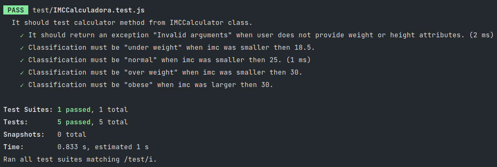

# Unit test with JEST and NODE.

This branch will solve one of the exercises passed by the professor.

## Exercise 02

Gives these classes, you should convert this code to [nodejs](https://nodejs.org/en/) and then write the following unit tests:
+ It should return an exception "Invalid arguments" when user does not provide positive values for height or weight.
+ classification must be "under weight" when imc was smaller than 18.5
+ classification must be "normal" when imc was smaller than 25.
+ classification must be "over weight" when imc was smaller than 30.
+ classification must be "obese" when imc was larger than 30.

***IMCCalculator.java***
```java
public class IMCCalculator {

    public IMCStatus calculate(Person p) {
        double weight = p.getPeso();
        double height = p.getAltura();
        
        if(weight <= 0 || height <= 0)
            throw new IllegalArgumentException();
        
        double imc = weight / (height * height);
        String classification = "";
        
        if(imc < 18.5)
            classification = "under weight";
        else if(imc < 25)
            classification = "normal";
        else if(imc < 30)
            classification = "over weight";
        else
            classification = "obese";
        
        return new IMCStatus(imc, classification);
    }
}
```

***Person.java***
```java
public class Person {
    String name;
    double weight, height;
    
    public Person(String name, double weight, double height) {
        this.name = name;
        this.weight = weight;
        this.height = height;
    }

    // include getters
}
```

***IMCStatus.java***
```java
public class IMCStatus {
    double imc;
    String classification;
    
    public IMCStatus(double imc, String classification) {
        this.imc = imc;
        this.classification = classification;
    }
    // include getters
}
```

## Test result

