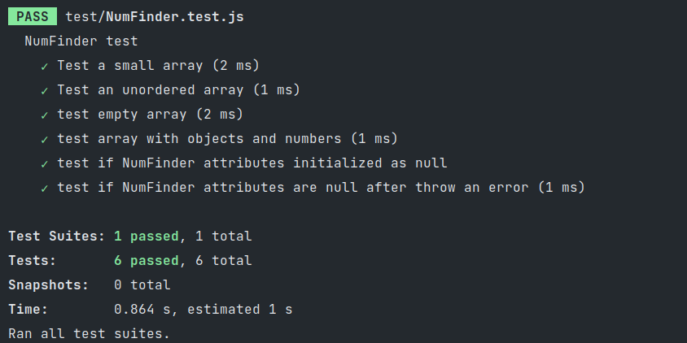

# Unit test with JEST and NODE.

This brand solves exercise 03.

## Exercise 03

Given the code from exercise [02 letter a](https://github.com/tgwow/TC-2020-02/tree/master/thiago_oliveira/firstNodeProject), extends it and implement more 2 tests.
+ test if NumFinder attributes initialized as null.
+ test if NumFinder attributes are null after throw an error

## Test result

