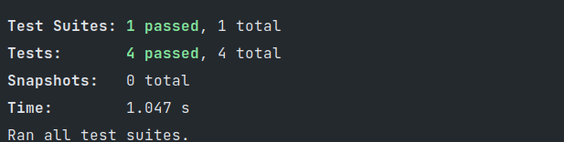

# Unit test with JEST, NODE and [validate](https://github.com/eivindfjeldstad/validate).

This brand solves exercise 04.

## Exercise 04

Implement all tests required by the [financing system](assets/04-Problema-TDD.pdf).

## Test result

