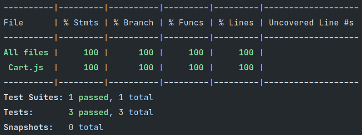

# Unit test with JEST and NODE

This brand solves exercise 05 using test coverage approach.

## Exercise 05

- Choose and implement 2 functions that have conditional branches and at least one loop
- Implementation of test cases that reach 100% of line and extension coverage for the 2 functions

## Tests
- Should return correct item list when there is only one item.
- Should return correct item list when there are two items.
- Should return correct item list when there are more than two items.
## Test result

